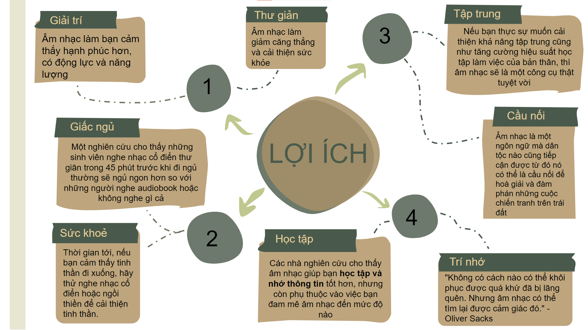
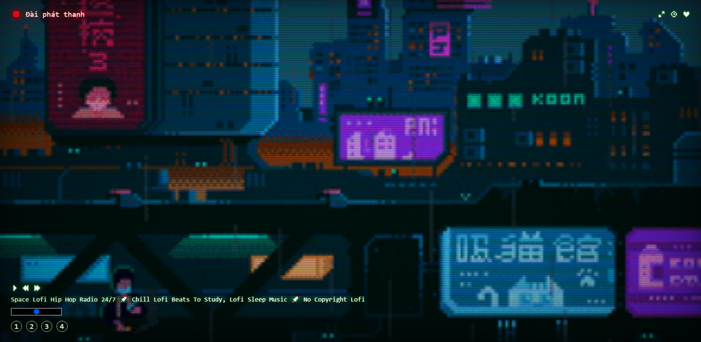
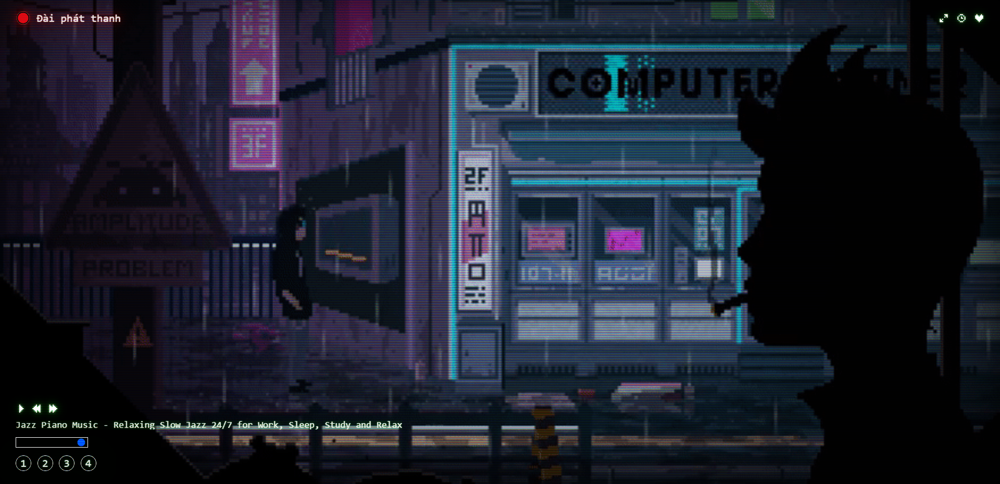
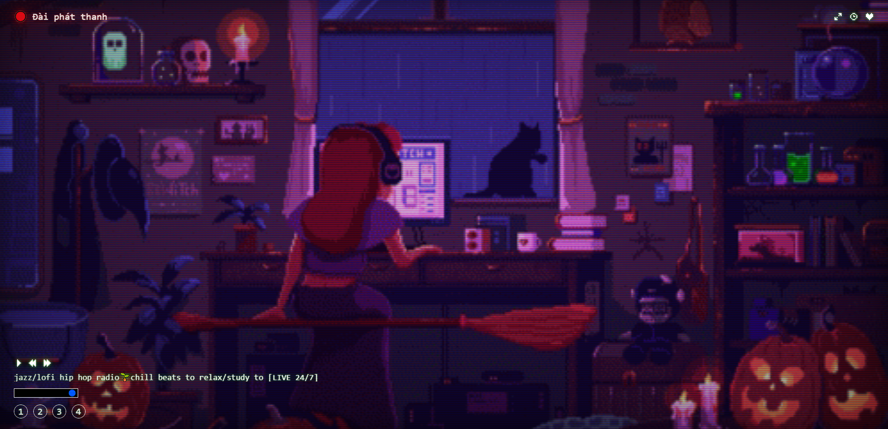

<h3 align='center'><strong><a href="#" target="_blank">DAIKI - 🌎 Lofi Music 🎧</a></strong></h3>

🦚 Dự án tốt nghiệp khoá Web Advanced tại MindX - Cuộc thi chung kết X-Talent Tháng 4 - Save The Earth🤙

### 🍄 Ngôn ngữ lập trình và công nghệ

- Dự án được phát khai và xây dựng trên 3 ngôn ngữ lập trình:

  - HTML 👨‍💻
  - CSS 🎨
  - Javascript 🧉

- Những công nghệ được áp dụng:
  - API Iframe Youtube 📫
  - Bootstrap 💨
  - Fontawesome 🍦
  - Embed Spotify 🔮
  - Embed Discord 🌐

### 🔨 Những tính năng chính

- Phát/Tạm dừng/Chuyển bài nhạc trực tiếp 🔴
- Chỉnh âm lượng 🔊
- Nghe những podcast từ Spotify 🎧
- Trò chuyện trực tiếp qua ứng dựng Discord 💬
- Cùng học theo phương pháp Pomodoro ⏰

### 🍵 Lợi ích mà sản phẩm đem lại

### 📷 Một số hình ảnh xem trước về dự án

